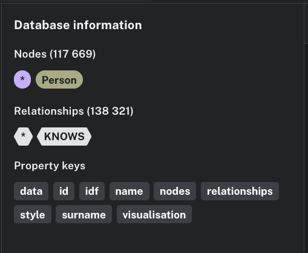
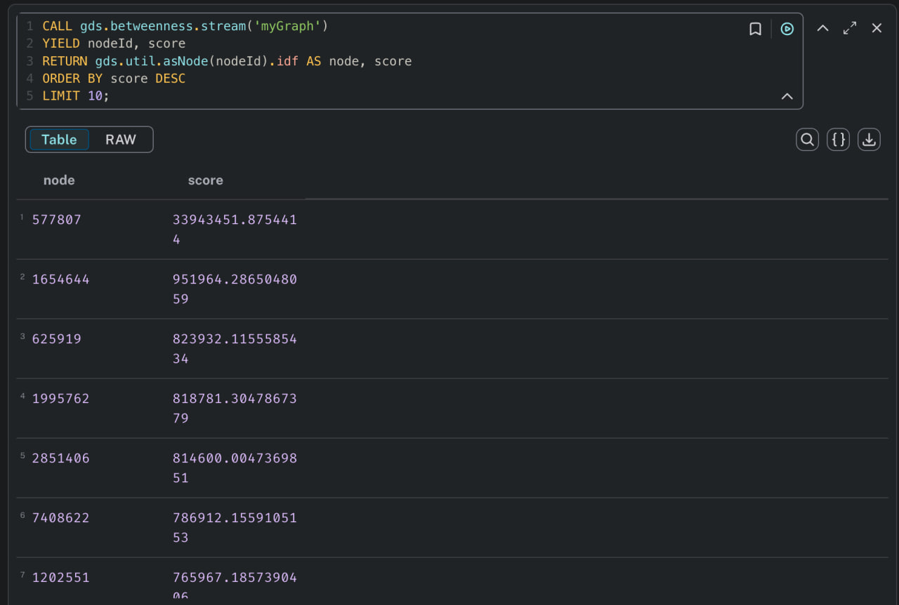
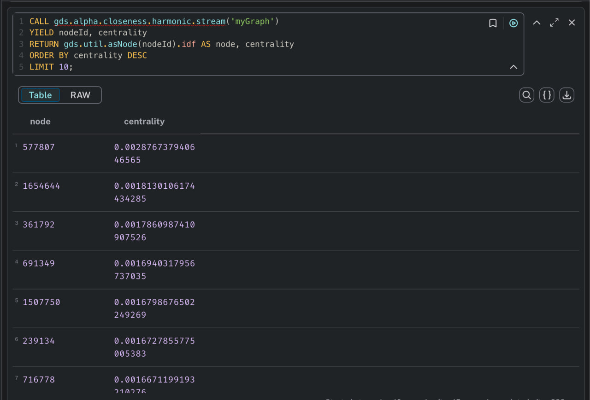
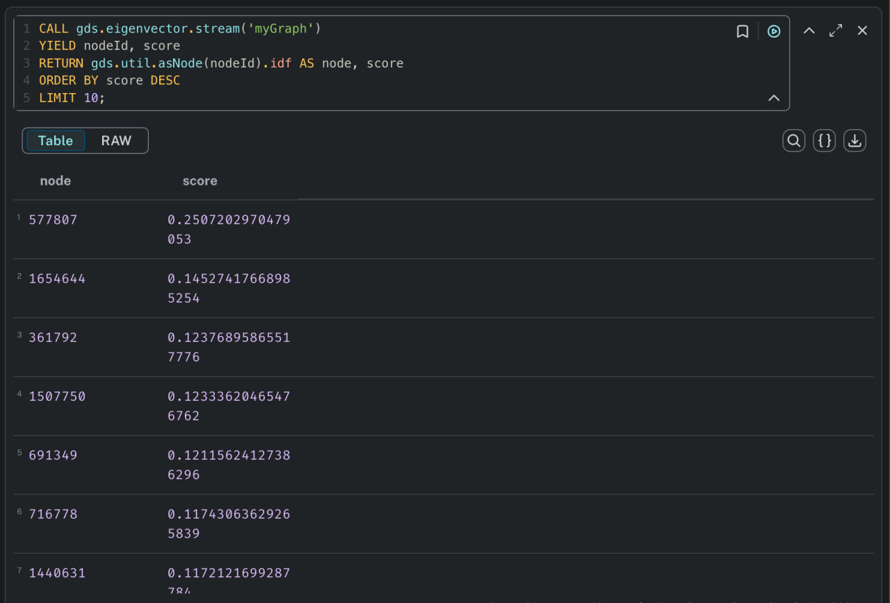

# ISATПроект по анализу социальных связей ВКонтакте

## Описание проекта

Данный проект разработан для сбора и анализа социальных связей пользователей социальной сети ВКонтакте с настраиваемым параметром вложения (глубиной обхода). Вся собранная информация о друзьях и их взаимосвязях записывается в графовую базу данных **Neo4j**, что позволяет проводить комплексный анализ социального графа.

## Требования к запуску

Для запуска проекта необходимо:

1. Создать файл `.env` в корневой директории проекта со следующими параметрами:
```bash
URI= # Адрес Neo4j сервера
DATABASE= # Название базы данных
AUTH= # Данные для аутентификации
TOKEN= # Токен доступа VK API
```
2. Иметь развернутый экземпляр Neo4j (рекомендуется версия 4.x или выше)

## Запуск проекта

Для запуска приложения выполните команду:

```bash
python ./main.py
```
## Результаты сбора данных
В ходе самостоятельной работы было собрано и проанализировано 117 тысяч пользователей и выявлено 138 тысяч взаимосвязей между ними, что формирует масштабный социальный граф для последующего анализа.


### Центральность по посредничеству (Betweenness Centrality)
Данная метрика определяет, насколько часто вершина (пользователь) выступает в роли "моста" на кратчайших путях между другими вершинами графа. Пользователи с высоким значением этой центральности имеют значительное влияние на поток информации в сети.


### Центральность по близости (Closeness Centrality)
Эта мера показывает, насколько вершина близка ко всем другим вершинам в графе. Пользователи с высоким значением близости могут быстрее взаимодействовать со всеми участниками сети.


### Центральность по собственному вектору (Eigenvector Centrality)
Метрика оценивает влияние вершины в сети, учитывая не только количество связей, но и "важность" связанных с ней вершин. Пользователи с высоким значением этой центральности связаны с другими влиятельными участниками сети.

